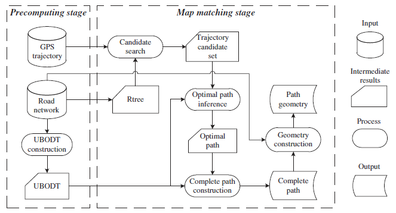

# 路网匹配论文总结
路网匹配将GPS轨迹点映射到实际的路网上。大多数现存的路网匹配算法使用各种权值函数从候选点中决定正确的位置。权值可以由很多信息来决定，比如GPS点到候选边的距离，当前的前进方向，道路的拓扑结构，物体的瞬时速度以及前后点之间的关联等。

权值算法主要分为两类:增量算法和全局算法。

增量算法每次读入最新的轨迹数据，只根据这个新数据和之前的已知数据来确定新数据所对应的的匹配的位置。增量算法更多的应用于实时应用场景。但是当采样率比较低的时候，匹配准确率下降的非常显著，也难以应付城市路网的复杂环境。

全局算法则是将一整段轨迹数据进行整体分析，所以可以对轨迹中的每一个点，利用该点前后的数据信息判断该点的最佳匹配位置。离线路网匹配使用全局算法能够获得更加准确的匹配的结果。如果一条轨迹的数据量太大，也有将轨迹数据进行切分的方式来达到提高匹配效率的问题。

----

首选浅谈一下隐马尔科夫模型HMM（Hidden Markov）。隐马尔科夫模型HMM是一个描述一个含有未知参数的马尔可夫过程统计模型。隐式马尔科夫模型五要素: 2个状态集合和3个概率矩阵。

>隐含状态S：马尔可夫模型中实际所隐含的状态，通常无法通过直接观测得到。这些状态之间满足马尔可夫性质
> 
>可观测状态O：可以通过直接观测而得到的状态，在隐马尔科夫模型中与隐含状态相关联。
>
>状态转移概率矩阵A：描述隐马尔可夫模型中各个状态之间的转移概率
>
>观测状态概率矩阵B：表示在t 时刻隐含状态是Sj 条件下，其可观测状态为Ok 的概率。
>
>初始状态概率矩阵π：表示隐含状态在初始时刻t=1 的概率矩阵

为了将隐马尔科夫模型HMM应用到路网匹配中，这里将每一个轨迹点作为一个可观测状态，将轨迹点组成的序列作为观测序列。而轨迹点的候选道路投影作为HMM求解的对象--隐含状态。由这些候选点（路段）构成的序列就是隐藏序列。这里需要决定的就是其转移概率和观测概率如何确定。隐马尔科夫模型HMM是路网匹配工作中非常流行的全局算法。

如何根据每个轨迹中的GPS点确定其由之前状态达到当前状态的具有最大的概率的候选点？一般是参考维特比算法（Viterbi）。其算法的主要思路是：
1. 初始化第一个观测点的所有可能状态概率。
2. 从前往后遍历每一个状态，对于每一个状态，用以下方法计算当前观测点的所有可能状态的概率：a)遍历当前观测可能对应的所有状态；b)对每个状态，遍历所有上一状态，通过公式 P(当前状态) = P(上一状态) * P(上一状态转移到当前状态) * P(当前状态观测) 来计算当前状态的概率。
3. 当所有观测点都遍历完之后，查找概率值最大的那个状态，然后查找这个概率值对应的上一状态，就这样一路往回找，所找到的序列（倒序的）就是最大概率的隐藏序列。

观测概率的确定：在这里一般的做法是将GPS点与其候选路段对应，一般而言，GPS定位的精度（每个点相对于路段的距离）大致满足正态分布，因此利用正态分布中的概率模型，可当做其观测概率。更多情况下，其观测代价可以由以下几个代价因素的进行加权平均：GPS点到路段的距离；GPS点前进方向和路段的方向差；GPS 点的速度与道路限速值的差异（低于限速值代价为 0，超过限速值就累加插值）。当然还有其他可以列入考虑的因素，根据不同的情况或不同的算法设计，可以采取不同的策略。

转移概率的确定：转移代价指从上一个点到这一个点的前进过程中，从上一个点对应的某个路段到这个点对应的某个路段的代价。最一般的情况下，可以比较前一个点到当前点的真实路径距离和其两点之间距离的差值（比值）。如果值越小说明匹配的越正确。当然可以在之上考虑其他的因素，通过加权平均的方式协调各个因素对最终匹配结果的影响大小。

利用Viterbi算法，其步骤流程如下：
1. 对所有点序列进行遍历；
2. 对当前遍历到的点，进行周边抓路，将抓到的路标记为候选路段；
3. 如果不是第一个点，则将上一个点的所有保留下来的候选路段进行一定距离的扩散，获得范围内每两条路段之间的最短路径，仅保留起点是上一个点的备选路段且终点这个点的备选路段的路径；
4. 计算代价，计算方法为：上一个点的候选路段代价 + 到这个点对应候选路段的转换代价 + 这个点的观测代价；
5. 搜索到最后一个点的时候，找到代价最小的候选路段，然后依次往前追溯，找到计算出这个最小代价时经过的所有节点（包括转换路径上的路段）。

## 1. Hidden Markov Map Matching Through Noise and Sparseness[GIS 2009]

在这篇论文中，作者通过经验和一定的数学推导最后得到的观测概率是$\mu$ = 0 和 $\sigma$ = 4.07的正态分布。$\sigma$使用绝对中位差进行估计。转移概率是用指数函数来拟合前后两个相邻GPS观测点的距离与两个候选点距离之差的绝对值。在初始时刻，使用观测概率来进行初始化。

|算法名称|HMM|
|:---:|:---|
|**算法类型**|**全局算法**|
|**观测代价的启发信息**|**GPS点相对于候选路段的距离满足的正态分布**|
|**转移代价的启发信息**|**\| 相邻GPS观测点的空间距离 - 两个候选点的实际最短距离 \|**|

---

## 2. Map-matching for low-sampling-rate GPS trajectories[GIS 2009]
ST-Matching 算法是一种处理低频采样数据的路网匹配算法。该算法是一种全局算法，综合了几何信息（GPS点与道路的距离）、道路拓扑信息（最短路径）、道路属性信息（每条道路的限速）。

作者基于的观测事实是：（1）真实的车辆轨迹一般是直的（2）真实的车辆轨迹会遵循道路的速度限制。

本文路网匹配的主要步骤是：首先根据路网数据构建的网格索引，取得轨迹点附近的候选路段。（2）根据轨迹的前后关系，对候选路段计算观测概率和转移概率（3）最后找到评分最高的轨迹。

观测概率N：GPS坐标点p和投影点c之间的距离，计算该点与投影点相匹配的概率。作者使用的是$\mu$ = 0 和 $\sigma$ = 20正态分布。转移概率V：其意义是GPS前后点之间的距离和其投影点之间的最短真实距离的比例。

时间分析：候选点之间的可能的速度与路径允许的速度作比较，判断其是在高速路上还是普通的路径上。

最终用类似Viterbi算法，在全局找到一条评分最高的路径（初始概率设置为每个点的观测概率）。当一条轨迹太长时，可以使用滑动窗口的方式，对部分轨迹进行匹配。

|算法名称|ST-matching|
|:---:|:---|
|**算法类型**|**全局算法**|
|**观测代价的启发信息**|**GPS点相对于候选路段的距离满足的正态分布**|
|**转移代价的启发信息**|**相邻GPS观测点的空间距离 / 两个候选点的实际最短距离**|
|**其他的启发信息**|**相邻候选点之间的估计速度与路径限制速度的比较信息**|
---

## 3. DeepMM Deep Learning Based Map Matching with Data Augmentation \[SIGSPATIALGIS 2019]

这篇文章的主要思想是结合已有的深度学习方法，充分利用历史轨迹数据的运动规律信息，来对轨迹的数据进行路网匹配，并减弱轨迹中噪声的影响。本篇文章中，利用embedding技术来表示地点和路段，减少了敏感噪音的影响。使用添加注意力增强机制的seq2seq模型是为了学习历史的轨迹数据特征。

这个框架的左半部分是对轨迹数据量进行拓展的方法，右半部分是深度学习模型。通过训练的模型来对新来的轨迹进行预测，最后通过全局路网匹配算法来得到匹配的路网轨迹。

模型中的输入数据是基于线段的轨迹。首先将整张地图分成100*100的正方形区域，将每个区域的ID转成一个one-hot向量。将输入的序列转成向量来进行相应的预测和训练。

|算法类型|全局算法|
|:---:|:---|
|**主要思想**|**利用深度学习对轨迹中匹配点位置进行预测**|

---

## 4. Effective map-matching on the most simplified road network[SIGSPATIAL 2012]

这篇文章提出了一种Passby的路网匹配算法。针对问题：由于路网数据占用很大的空间，如何在简化了路网信息的情况下进行路网匹配。这篇文章将路网信息中的每条路（可能包含多个路段）简化为{id，start，end}。在简化的路网信息会使得路网中的很多特征发生改变。如下图所示，实际道路变弄成简化道路后失去了曲线特征，因此处于$p_i$的点有更大概率匹配到另一条路上。

主要思想：一辆车的行驶轨迹是否能够匹配到一个路段上，可以通过判断车辆试否从该路段进出来决定，这里利用的信息是车行驶的轨迹是否通过了这段路的始末点。假设当前查询点是$p_{i}$，如果GPS点$p_{i-1}$和$p_{i}$，通过一段路的起点$e.start$。并且其后轨迹中存在$p_{j-1}$和$p_{j}$通过了这一段路的$e.end$，此时可以将{$p_{i}$,...,$p_{j}$}匹配到该路段上。如果其后的点不满足情况，就将$p_{i}$匹配给概率最大的一段路中。

车行驶的轨迹是否通过了这段路的始末点：在下图中，作者标出了四个变量，四个变量的加权和可以作为其是否通过路口的指标（未给出具体公式）。一般而言更短的距离（$d_t和d_p$）和更小的角度（$\theta_t和\theta_i$）更好。

|算法类型|全局算法|
|:---:|:---|
|**添加的启发信息**|**利用轨迹在路网中存在的关系来判断是否将点匹配到路段上**|
---

## 5. Fast Viterbi map matching with tunable weight functions. SIGSPATIAL \[GIS 2012]:

这篇论文的方法基于前面提到的HMM算法，综合了存在的路网匹配算法，选择了两个最合适的权重，并对路网匹配算法做了很多优化。

HMM公式：

这里$\beta$和$\sigma$都是根据数特征据得出的公式，$l_i$是两个GPS点对应的匹配点之间的真实最短距离，$l_{i,0}$是两个GPS点之间的空间距离。如果两个距离之间大小越相近，就说明越是可能的匹配。将如上公式取log得到如下的公式。

上面公式中，$\alpha = 2 \sigma^2/\beta$。论文中将HMM中的$l_i - l_{i,0}$替换成了$- l_i / l_{i,0}$（一般为$l_{i,0}/l_i$）。作者对方法进行了比较，发现改进的方法在采样率较高的情况下效果较好，而HMM在采样率较低的时候效果较好，于是作者考虑了采样间隔时间因素，最后得到计算的公式如下：

其中，$t_i$是$z_i$和$z_{i-1}$之间的采样间隔。

算法的瓶颈是所有相邻匹配点之间的最短路径计算。作者在Dijkstra算法中添加了sample_interval * 50m/s的搜索范围限制。

为了减少候选集的大小，作者将搜索半径限制在30米以内，因为对于训练数据集来说，样本与其匹配的道路之间的最大距离约为25米。

|算法类型|全局算法|
|:---:|:---|
|**主要思想**|**综合了不同路网匹配算法概率计算公式的优点**|
|**搜索的优化**|**考虑了轨迹数据和路网数据的特性，设置了相对合适的搜索半径**|
|**最短路径计算中的优化**|**在Dijkstra算法中设置了最大的距离了限制，避免盲目搜索**|

---

## 6. Quick map matching using multi-core CPUs \[SIGSPATIALGIS 2012]

本文考虑到现有的方法如HMM，已近取得了较高的准确率。因此本文关注方向是减少路网匹配进行的时间。这篇文章的方法充分利用了多线程的思想。多线程思想可以应用到索引的构建、搜索和路网的匹配上。本文对上面的HMM方法进行了一点改进，考虑了路段的速度信息，避免轨迹匹配到主路旁的辅路上。

索引的构建：本文首先将地图划分成网格，每个网格记录在内的或与其相交的路段，每组网格中的路段利用多线程进行索引的并行构建。

索引的搜索：对于一个查询点，首先取得该点所在的区域。之后得到该区域附近的8个相邻区域，如果这个区域与查询点之间的距离小于50m，就将其纳入到候选区域中。再对所有候选区域中的所有路段进行判断，判断其与查询点的距离是不是小于50m，将不符合条件的路段排除。最终得到所有的候选路段。

路网匹配：本文对所有轨迹进行分组，对每个组进行路网匹配（多线程进行）。路网匹配的算法使用的是HMM。

添加的启发式信息：该方法还考虑了主路和辅路的匹配问题。辅路上的车辆车速一般比主路上的慢，因此在转移概率上加上了速度限制。

|算法类型|全局算法|
|:---:|:---|
|**索引的构建**|**利用划分的网格对路段进行分组，每组构建一个索引结构（并行）**|
|**搜索的优化**|**利用划分的网格和每个网格中构建的索引结构，快速找到GPS点的所有的候选路段**|
|**添加的启发信息**|**考虑了主路和辅路速度的差异信息**|

---

## 7. An efficient algorithm for mapping vehicle trajectories onto road networks \[SIGSPATIALGIS 2012]

索引的构建：首先根据路网中的所有节点构建网格索引。

候选路段集的获取：(1) 对于一个轨迹点，首先搜索与查询点$q_i$最近的50个路网节点，得到查询点的候选路网节点集，判断路网节点在哪个路段上，根据这些候选轨迹段得到候选路段集$S$（目标是得到$q_i$的精确候选路段集$C_i$，$C_i \in S$ ）。

(2) 由于两个相邻的点更可能被匹配到同一条路段上。假若已经得到了前一个点的精确确候选路段集$C_{i-1}$，首先将同时出现在$S$中和$C_{i-1}$中的边加入到集合$S'$中，其次找到$S$中的某些边的起点等于$C_{i-1}$中某些边的终点的边，将这些边也放到集合$S'$中。

(3) 再对集合$S'$进行进一步细化，首先剔除与轨迹点p之间距离大于18m的路段。其次对每个路段（有很多小路段组成）连接其首尾点得到线段$L$，计算线段$L$与$e$={$q_{i-1}$,$q_i$}之间所成的角度$\alpha$，如果$\alpha$大于90度，将该路段剔除出$S'$。如果$S'$不为空，将$C_i$设置为$S'$。

(4) 如果$S'$为空，重新考虑集合$S$，对集合中每个路段$e$，计算如下所示分数。其中下式中的各种参数是人为指定的，作者已在论文中给出。其意图是，路段与查询点越接近，$L$与$e$={$q_{i-1}$,$q_i$}所成的角度越小，就有更大概率进行匹配。得到所有分区中最大的$score$，剔除分数小于$0.8*score$的边，最后得到$C_i$。

路网匹配：假若$P_i$是点$q_i$的候选轨迹段上的匹配点集，首先构造两个虚拟点s和t，分别指向所有的$P_1$（起始点的匹配点）和$P_m$（某点的匹配点），设置所有的权重为0，计算从s到t的最短路径，需要满足如下两个条件（1）每个点集中至少有一个点要出现在路径中（2）必须依次通过所有的点集。经过这些步骤之后，得到的候选点$p_i'$所在的边$e_i$作为最佳匹配。

|算法类型|全局算法|
|:---:|:---|
|**索引的构建**|**对路网中的所有点构建空间索引**|
|**搜索的优化**|**考虑GPS前后点之间的联系，对不符合条件路段进行快速过滤**|
|**路网匹配的思想**|**利用状态概率设置权重信息，找到一条从起始点到终止点的最短路径**|

---
## 8. Fast map matching, an algorithm integrating hidden Markov model with precomputation \[IJGIS 2018]

算法包含两个部分：预计算部分和隐式马尔科夫过程部分。

1. 预计算部分、
  
   最短路径的计算：论文中的方法是遍历图中的每一个点，将该点到其他点小于一个阈值$\delta$的最短路径信息(SP)存储到一张表Upper Bounded Origin Destination Table(UBODT)中。其每一条信息的存储方式如下：$R(n_o, n_d) = (n_o, n_d, next_n, next_e, prev_n, dist)$。在这里$n_o, n_d$指代起始点和末点的id号，$next_n, next_e, prev_n$指代在这个路径中(way)起始点的下一个的点的id、起始点指向的边的id和路径中末点之前点的id。SP信息由Dijkstra算法生成。最终UBODT存储成hash table形式，其对应关系是：$h = (n_o*M + n_d) mod H$。因此任意两点之间的最短径长度可以通过之前存储的信息以递归的方式获得。如果没有找到最短路径长度，此时才采取其他策略（设置为最大值或利用dijkstra来进行计算）。

2. 隐式马尔科夫过程

    (1) 候选投影点(候选路段)的查找：文中使用的是在R-tree中查找一个GPS点的r范围内的k最近邻(KNN)候选。每条信息存储成$C = (p,e,dist,\lambda)$，分别代表投影点，候选边，GPS点到线距离，投影点到起始点的距离。在实际中，作者搜索时首先构建一个以GPS点为中心，以2r为边长的正方形，找到所有与正方形相交的路段（或内部），再将点投影到路段上，筛除GPS点到线的距离大于r的路段，对剩下的候选按距离进行排序。

    (2) 最佳路径的选取：投影点之间的路径可能存在的4种情况如下图所示。这里考虑到的是行驶方向的问题，这样可以使得真实GPS点的距离和最短路径距离的比值更加准确。

   

   

   (3) GPS点可能投影的位置有如下三种情况。由于转移概率的计算很多是使用，GPS点真实空间距离/匹配点之间的最短距离。因此，第一种情况是GPS之间距离大于路径距离，其转移概率大于1。第二，三种情况是两个点投影到同一个点使得分母为0。

   

   文章中转移概率如下，第一种情况概率值小于1，第二三种情况概率值等于0。
   

   论文中的观测概率依旧如HMM中的标准正态分布一样。最终可以通过viterbi算法得到最优的匹配路径（OPI）。

   (4) 在找到最优的匹配路径后OPI，作者希望找到一整条完整的路径CPI（利用OPI信息）。作者整个查询的过程中只在这里才使用最短路径的计算。前面的最短路径都是通过预计算得到的，这样就节省了时间。

   (5) 惩罚机制：如下图所示，GPS点$p_n$匹配后可能在计算最短距离时经历了一个反向运动。因此文中在投影点之间的最短距离计算之上添加了一个惩罚距离。pf为惩罚因子。在施加惩罚后，包含反向运动的路径很可能被赋以较低的转移概率，并在OPI步骤中被消除。
   
   

|算法类型|全局算法|
|:---:|:---|
|**最短路径计算中的优化**|**将部分小于某个阈值的最短路径距离存储起来，可以直接通过递归的方式得到两个点之间的最短路径距离，节省了计算时间**|
|**添加的启发信息1**|**投影点之间最短路径距离可以利用行驶方向的信息得到更加精确的值**|
|**添加的启发信息2**|**转移概率的特殊情况的优化**|
|**添加的启发信息3**|**对经历反向运行的轨迹进行优化**|

---

## 9. Online map-matching based on Hidden Markov model for real-time traffic sensing applications[ITSC 2012]

这篇论文中在计算观测概率和转移概率的时候和HMM类似。

观测概率：在计算观测概率时，除了计算一般的观测概率，作者还考虑了道路的宽度信息和实时情况的速度信息。其计算公式如下：

转移概率：与HMM类似，使用的是GPS点空间距离与匹配点最短距离的比值。

这篇论文处理充分利用汇聚点的信息处理实时路网匹配，假设在当前时间的所有点在马尔科夫链中都汇聚于上一个时间的某一个点（转移概率最高），就将上一个时间的那个点记为汇聚点。每得到一个汇聚点，将该汇聚点和前一个汇聚点之间的具有最大转移概率的路径输出。若在不断向后处理的过程中没有汇聚点出现，当时间超过一定时间时，就直接将具有最大转移概率的路径进行输出。

|算法类型|增量算法|
|:---:|:---|
|**实时数据处理的思路**|**在顺序处理的过程中，将汇聚点之间的路径进行输出**|

## 10. GeoMatch: Efficient Large-Scale Map Matching on Apache Spark[Big Data 2018]

论文目标：在分布式环境中，找到每个轨迹数据点的候选匹配路段。

希尔伯特填充曲线：希尔伯特填充曲线可以对空间区域进行划分。划分的每个单元格，由于其空间的邻近性，在单元格上相近的点，其对应希尔伯特值也比较接近。

论文利用希尔伯特构造曲线的构造方式，对整个路网区域按照设置的并行度进行分区，将相邻的单元格进行聚集，使得每片区域具有大致均等数量的路网路段，保证了负载的均衡。再对每个分区中的空间数据构建本地R-tree索引，便于每个分区的查找。

对于一个查询点，找到其对应的分区，查找其候选的匹配路段。

|算法类型|分布式算法|
|:---:|:---|
|**分区思路**|**利用希尔伯特填充曲线的空间邻近性将空间进行分区，保证负载均衡**|

## 11. A framework for parallelmap-matching at scale using Spark[DPD 2019]

论文目标：在分布式环境中，找到每个轨迹数据点的候选匹配路段。对所有的结果进行收集，利用前面的路网匹配算法计算最优匹配。

论文首先对所有待匹配轨迹进行采样，构建一个四叉树索引结构，并将索引通过广播的方式传递给每一个节点。其次将所有路网数据和轨迹数据利用四叉树索引找到相对应的分区。在相应的分区中，查找每个轨迹段的候选匹配路网路段。最后将所有结果按照轨迹的序号进行收集，利用路网匹配算法对轨迹进行匹配。

|算法类型|分布式算法|
|:---:|:---|
|**分区思路**|**利用采样信息将轨迹数据和路网数据分配到不同的分区节点中进行查找**|

